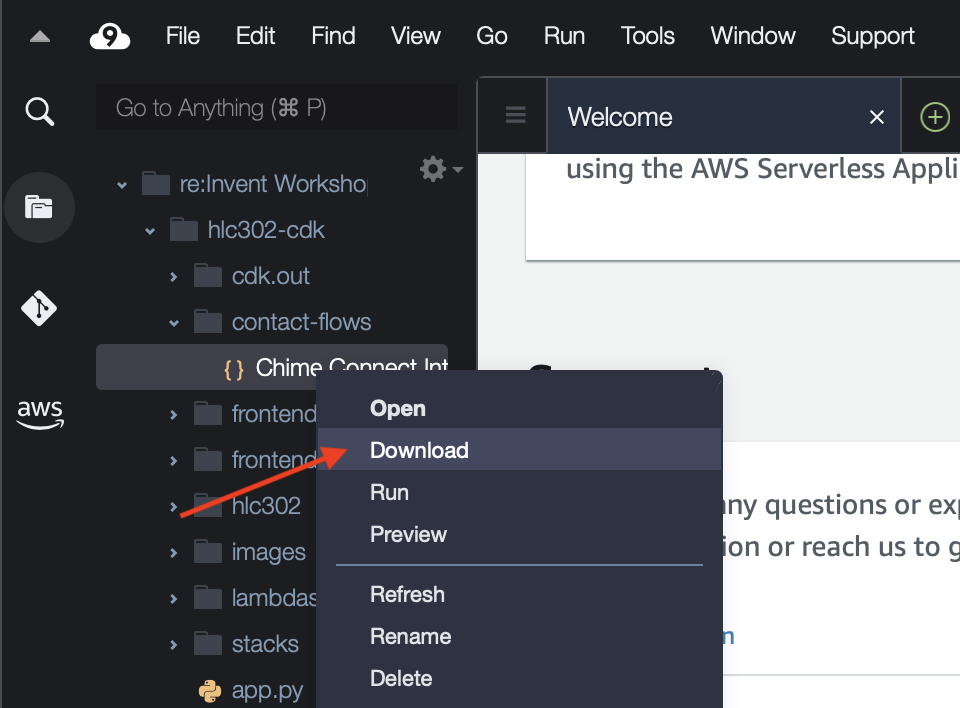
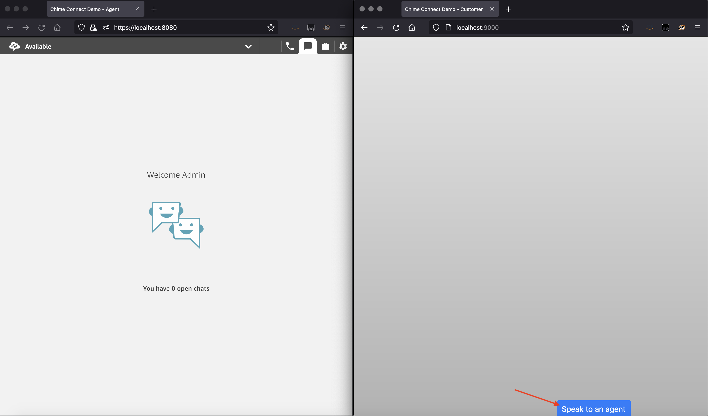

# HLC302 Reinvent Builders Session
In late 2019 and early 2020, the concept of a “routine” shifted overnight in both professional and personal arenas. Terms like “social distancing”, “shelter at home”, and “quarantine” have become mainstream buzzwords, and many jobs normally accomplished in an office (like doctor visits) have moved to virtual settings. Telehealth is the use of two-way telecommunications technologies to provide clinical health care through a variety of remote methods. Making doctor-patient communication accessible through multiple channels (such as voice, chat, and video) without imposing downloads or additional requirements has become critical to improve patient experiences for healthcare organizations.

In this session, you will learn how to deploy a Telehealth solution that allows communication via chat, video and audio between the patient and a doctor (referred to as customer and agent here). The customer can connect to an agent over these communication channels via a browser-based interface that can be used as a standalone site, integrated into existing website, mobile app, etc. This is especially relevant in virtual patient care settings when you may want to start an interaction over chat or voice, and enable movement into video. This creates a more tailored and personalized experience for your customers while allowing for the ease of virtual appointments.

The solution is built using Amazon Connect, Amazon Lex, Amazon API Gateway, AWS Lambda with automated deployment using Cloudformation via AWS Cloud Development Kit (CDK) via AWS Cloud9 IDE.

** **Warning: Adopting this solution does not make the deployment HIPAA compliant. This solution is a proof of concept and not production ready intended to illustrate tools and services that customers can use as a guidance to build a similar solution on AWS. For more information about HIPAA Compliance on AWS [click here](https://aws.amazon.com/compliance/hipaa-compliance/).** **

## Architecture


- [Amazon Connect](https://aws.amazon.com/connect/) - omnichannel cloud contact center that helps you provide superior customer service at a lower cost. You can set up a Virtual Contact Center in minutes and then easily configure the service using a single graphical console to design powerful contact flows, manage your agents, and track performance metrics.
- [Amazon Lex](https://aws.amazon.com/lex/) - fully managed artificial intelligence (AI) service with advanced natural language models for building conversational interfaces into applications.
- [Amazon Polly](https://aws.amazon.com/polly/) - artificial intelligence (AI) service that turns text into lifelike speech, allowing you to create applications that talk, and build entirely new categories of speech-enabled products.
- [Amazon CloudFormation generated using the AWS CDK](https://docs.aws.amazon.com/cdk/latest/guide/home.html) - lets you model, provision, and manage AWS and third-party resources by treating infrastructure as code.
- [Amazon API Gateway](https://aws.amazon.com/api-gateway/) - fully managed service that makes it easy for developers to create, publish, maintain, monitor, and secure APIs at any scale.
- [Amazon Chime SDK](https://aws.amazon.com/chime/chime-sdk/) - a set of real-time communications components that developers can use to quickly add messaging, audio, video, and screen sharing capabilities to their web or mobile applications.
- [AWS Cloud9](https://aws.amazon.com/cloud9/) - a cloud-based integrated development environment (IDE) that lets you write, run, and debug your code with just a browser.
- [AWS Lambda](https://aws.amazon.com/lambda/) - a serverless, event-driven compute service that lets you run code for virtually any type of application or backend service without provisioning or managing servers.

## Event Engine Accounts

*Before clicking on this link please make sure you are signed out of any other AWS Account or open the link in a private browser*.

1.	Open the Event Engine link provided in a browser 
2.	Verify the event hash and select **Accept Terms & Login**
3.	Select **Email One-Time Password (OTP)** option
4.	Enter your email address and click **Send passcode**
5.	Wait for the email to arrive with your 9 digit passcode (takes a few minutes)
6.	Go back to webpage and enter the 9 digit passcode and click **Sign In**
7.	Before the event begins the Event Engine dashboard will show an Event Not Running message. When the event starts, use the following instructions to sign in to the AWS Console: 
8.	Click **AWS Console**
9.	Click **Open AWS Console**

*You should now be logged into the AWS Console. You will be using this account for the builder’s session today. Please do not use anyone else’s login.*


## Getting Started
1. Select the Region drop down in the top right corner of the console and ensure it is set to **N.Virginia**
    
    

2. Navigate to **Cloud9** in the AWS Console
    
    

3. Click **Create environment**
    
    

4. Give the environment a **Name** 
    
    

5. Click **Next step**
6. Next change the **Instance type** to `t3.small` and leave the rest of the settings with their default selections
    
    

7. Click **Next step**
8. Click **Create environment**. It will take a few minutes for your Cloud9 environment to be ready.

## Installations 
*This application deployment requires a few dependencies.*

- [NodeJS](https://nodejs.org/en/download/) - You will need to install Node.js and NPM **on your local machine** to run the final application locally. You can do this while waiting for your Cloud9 environment to be ready.
    - For **Windows** machines, please follow the instructions at https://phoenixnap.com/kb/install-node-js-npm-on-windows
    - For **Mac** machines you will install NVM, a version manager for Node.js that allows you to quickly change and manage different Node.js versions on the same machine
        1. Follow steps found here: https://github.com/nvm-sh/nvm#install--update-script
        2. Verify it worked: `nvm list`
        3. Install Node.js version 16: `nvm install 16 --lts`


- [AWS CDK](https://docs.aws.amazon.com/cdk/latest/guide/getting_started.html#getting_started_install)
- [Python >=3.7](https://www.python.org/downloads/release/python-3614/)

*Since we are using Cloud9 today the AWS CLI and Python is already taken care of for us, so we will just have to install Node.js and the aws-cdk.*

1. Once the Cloud9 IDE loads the terminal on the bottom of the screen, run the following commands to install the correct version of Node.js and the aws-cdk:
    
    
    
    ```
    curl https://raw.github.com/creationix/nvm/master/install.sh | sh
    . ~/.bashrc
    nvm install 14.17.5
    nvm use 14.17.5
    nvm alias default v14.17.5
    ```
## Deploying the Infrastructure 

*Next we are going to clone the repo and start our virtual environment*

1. Clone the repo from GitHub (**Note: you will check out a specific branch as specified by your table instructor)
    ```
    git clone https://github.com/awstomburge/hlc302-cdk.git
    cd hlc302-cdk
    git checkout -b <BranchNameGivenByInstructor>
    ```
2. Create and activate a virtual environment for python
    ```
    python -m venv hlc302
    source hlc302/bin/activate
    ```
3. Install the AWS CDK
    ```
    npm install aws-cdk -g
    ```
4. Install the package dependencies used by this solution
    ```
    pip install --upgrade pip
    pip install -r requirements.txt
    ```

*Now we can deploy the CDK templates to create the infrastructure in our AWS account*

4. Since we’ve never deployed the AWS CDK in this account before we must bootstrap it first and then we will deploy it (*this will take approximately 15 minutes to complete*):
    ```
    cdk bootstrap
    cdk deploy --all --require-approval never -O frontend-agent/src/cdk-outputs.json
    ```
5. Now we can exit out of the virtual environment:
    ```
    deactivate
    ```
## Post Deployment
*Once the deploy completes, follow the steps below:

1. Navigate to **Amazon Connect** in the AWS Console. Click on the **Instance alias** for your instance. It will start with *reinvent2021*.
2. From the left navigation, click on **Contact Flows**. 
Under the **Amazon Lex** section, select the Bot called `StartVideoCall(Classic)` in the **Bot** box.  Click the button that says **+ Add Amazon Lex Bot**. 
3. From the left navigation, click on **Approved origins**. Click the **Add domain** button, enter `https://localhost:8080`, and click the **Add domain** button to save the change. Your list of domains should now look like this:

4. In the navigaton pane on the left, click on the **Overview** link and then click on your Amazon Connect **Access URL**. A new window will open, prompting you to sign in to your Amazon Connect Instance. Sign in with these credentials:
    - Username = admin  
    - Password = AdminPassword1!

5. In the Amazon Connect console, hover over the **Routing** icon and select **Contact flows**. 

6. On the screen that appears, click the **Create contact flow** button. 
7. Next you will download the `Chime Connect Integration Flow.json` file from your Cloud9 IDE onto your local machine, so that you can import it into Amazon Connect as a contact flow.
    - Download the file `contact-flows\Chime Connect Integration flow.json` to your local machine from your **Cloud9** IDE:
    
    - In Amazon Connect contact flows browser tab/window, click the arrow at the upper right corner of the screen and select **Import flow (beta)**. 
    - In the box that appears, select `Chime Connect Integration flow.json` from the location where you downloaded it. Click **Import**.  
    You will now see your contact flow is populated with a number of contact blocks, including blocks for *Get Customer Input* and *Play Prompt*, with different prompts played based on the customer input provided.
8. Click the **Save** button. Then click the **Publish** button. 
9. Under the contact flow name (top left side of the screen), click the **Show additional flow information** link. Copy the ID that appears in the ARN after `/contact-flow/`. For example, if your ARN is `arn:aws:connect:us-east-1:999999999999:instance/a1111111-1111-1111-1111-b11111111111/contact-flow/a1111111-b222-c3333-d4444-e55555555555`, you'll copy `a1111111-b222-c3333-d4444-e55555555555` for use in the next step. This value is the **Flow ID**.
 
 
10. In the AWS Console, navigate to *Systems Manager* and click on *Parameter Store* on the left-hand side. 
Click the **Create parameter** button. 
 
11. In the **Name** field, enter `hlc302-flow-id`. In the **Value** field, enter the **Flow ID** that you copied from the previous step. Click the **Create parameter** button to save the value.
12. Navigate to *API Gateway*. Click the API called `start-chat-connect`. From the **Actions** menu, select **Enable CORS**. 
 Check the boxes for `DEFAULT 4XX` and `DEFAULT 5XX`. Click the **Enable CORS and replace existing CORS headers** button. Click **Yes, replace existing values**. In the result, it is ok if you see an error (a red X) next to *Add Access-Control-Allow-Origin Integration Response Header Mapping to POST method*.
13. Select **Actions** and **Deploy API**. In the box that appears, select `prod` in the **Deployment Stage** box and click **Deploy**.
14. In the navigation pane on the left go back to APIs. Repeat steps #12 and #13 for the `chime-meeting-operations` API in API Gateway. It is ok if you see a red X next to the configurations for the OPTIONS methods when enablings CORS.

## Starting the Agent's View
1. In your Cloud9 IDE, right click the folder `frontend-agent` and click Download to download the folder to your local computer.
2. Once the folder has been downloaded, unzip it and then, in your local terminal/command line, `cd` into the unzipped folder:
    ```
        cd frontend-agent
    ``` 
3. Install, build, and start frontend-agent:
    ```
        npm install --force
        npm run build  
        npm run start  
    ```  
    *Note: if you're on a Mac and get an error similar to `gyp: No Xcode or CLT version detected!` when running `npm install`, then you also need to `xcode-select --install` to install the Xcode Command Line Tools, and after that re-run the above steps to install, build, and start the frontend-agent, starting with `npm install --force`  
    If your default web browser is Safari, you will likely have to switch to Chrome or Firefox at ths point, manually sign in to your Amazon Connect instance using the URL and the credentials as instructed above in *Post Deployment* Step 4, and then re-open the Agent's view (https://localhost:8080/). You may safely ignore a certificate error and proceed to view the web page.
    
Once the Amazon Connect chat screen appears, change your status to **Available** (in the upper left corner, select Offline and change it to Available).


## Starting the Customer's View
1. Back in Cloud9, run the script in Cloud9's console terminal:
    ```
    sh config_generator.sh
    ```
2. Right click the folder frontend-customer, press download, and then unzip the folder on your local computer
3. Once the folder is unzipped, open that folder in a new local terminal/command line window and `cd` into the unzipped folder:
    ```
    cd frontend-customer
    ```
4. Install, build, and start frontend-customer  
    ```
    npm install --force
    npm run build  
    npm run start  
    ```

You should now have two browser windows open, one for the agent view, and one for the customer view. In the customer view, start the chat by clicking on the "Speak to an agent" button:


When prompted, type in `chat` into the Chat. After that, in the agent view, you will be prompted there to accept the chat. You may chat between the customer and the agent. When ready, use the "Join vido call" buttons to move the conversation to video chat. You may have to tell your web browser to give the web pages access to your camera and microphone.
