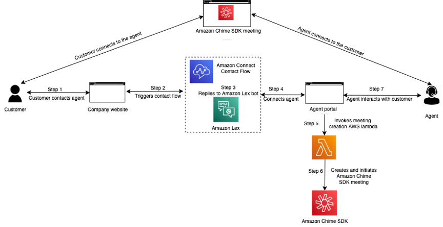

# HLC302 Reinvent Builders Session
The overall design is to be able to escalte calls to video. This is especially relevant in xyz. It creates a more tailored and personalized experiance for your customers while allowing for the ease of virtual appointments.

*****Warning this solution out of the box is not HIPPA compliant it is a proof of concept for tools you can use in AWS that will allow you to accomplish this goal**

## Architecture



- Amazon Connect - omnichannel cloud contact center that helps you provide superior customer service at a lower cost.
- Amazon Lex - fully managed artificial intelligence (AI) service with advanced natural language models for building conversational interfaces into applications.
- Amazon CloudFormation - lets you model, provision, and manage AWS and third-party resources by treating infrastructure as code.
- Amazon API Gateway - fully managed service that makes it easy for developers to create, publish, maintain, monitor, and secure APIs at any scale.
- Amazon Chime SDK - a set of real-time communications components that developers can use to quickly add messaging, audio, video, and screen sharing capabilities to their web or mobile applications.
- AWS Cloud9 - a cloud-based integrated development environment (IDE) that lets you write, run, and debug your code with just a browser.
- AWS Lambda - a serverless, event-driven compute service that lets you run code for virtually any type of application or backend service without provisioning or managing servers.

## Event Engine Accounts

*Before clicking on this link please make sure you are signed out of any other AWS Account or open the link in a private browser*.

1.	Open the Event Engine link provided in a browser 
2.	Verify the event hash and select **Accept Terms & Login**
3.	Select **Email One-Time Password (OTP)** option
4.	Enter your email address and click **Send passcode**
5.	Wait for the email to arrive with your 9 digit passcode (takes a few minutes)
6.	Go back to webpage and enter the 9 digit passcode and click **Sign In**
7.	Before the event begins the Event Engine dashboard will show an Event Not Running message. When the event starts, use the following instructions to sign in to the AWS Console: 
8.	Click **AWS Console**
9.	Click **Open AWS Console**

*You should now be logged into the AWS Console. You will be using this account for the builder’s session today. Please do not use anyone else’s login.*


## Getting Started
1. Select the Region drop down in the top right corner of the console and ensure it is set to **N.Virginia**
    
    

2. Navigate to **Cloud9** in the AWS Console
    
    

3. Click **Create environment**
    
    

4. Give the environment a **Name** 
    
    

5. Click **Next step**
6. Next change the **Instance type** to *t3.small*
    
    

7. Click **Next step**
8. Click **Create environment**
9. Navigate to the EC2 console
10. Under the **Instances** tab, check the box next to the instance (the name should start with `aws-cloud9-`). From the **Actions** menu, select **Security** and **Modify IAM Role**.
11. Select the role called `Cloud9AdminAccess` and click **Save**.
12. In the Cloud9 IDE, click the gear icon (top right). Under **AWS Settings** turn off **AWS managed temporary credentials**.

## Installations 
*This application requires a few installations we will need the following packages installed.*

- [NodeJS](https://nodejs.org/en/download/)
- [AWS CDK](https://docs.aws.amazon.com/cdk/latest/guide/getting_started.html#getting_started_install)
- [Python <=3.7](https://www.python.org/downloads/release/python-3614/)

*Since we are using Cloud9 today the AWS CLI and Python is already taken care of for us, so we will just have to install [NodeJS] and the [aws-cdk].*

1. Once the IDE loads in the terminal on the bottom of the screen run the following commands to install the correct version of [NodeJS] and the [aws-cdk]
    
    
    
    ```
    curl https://raw.github.com/creationix/nvm/master/install.sh | sh
    . ~/.bashrc
    nvm install 14.17.5
    nvm use 14.17.5
    nvm alias default v14.17.5
    ```
    ```
    npm install aws-cdk -g
    ```
## Deploying the Infrastructure 

*Next we are going to clone the repo and start out virtual environment*

1. Clone the repo from github
    ```
    git clone https://github.com/awstomburge/hlc302-cdk.git
    ```
2. Create and activate a virtual environment for python
    ```
    cd hlc302-cdk
    python -m venv hlc302
    source hlc302/bin/activate
    ```
3. Install the packages
    ```
    pip install --upgrade pip
    pip install -r requirements.txt
    ```

*Now we can deploy the CDK templates to create the infrastructure*

4. Since we’ve never deployed the AWS CDK in this account before we must bootstrap it first and then we can deploy it
    ```
    cdk bootstrap
    cdk deploy --all --require-approval never -O frontend-agent/src/cdk-outputs.json
    ```
5. Now we can exit out of the virtual environment
    ```
    deactivate
    ```
## Post Deployment
*Once the deploy completes, follow the steps below.*

1. Open **Amazon Connect** in the AWS Console. Click on the **Instance alias** for your instance. It will start with *reinvent2021*. 
2. From the left navigation, click on **Contact Flows**. 
Under the **Amazon Lex** section, select the Bot called `StartVideoCall(Classic)` in the **Bot** box.  Click the button that says **+ Add Amazon Lex Bot**. 
3. From the left navigation, click on **Approved origins**. Click the **Add domain** button and enter `https://localhost:8000` and `https://localhost:9000`. Click the **Add domain** button to save the change. 

4. Now click on the Amazon Connect **Access URL**. 
    - user_name = admin  
    - user_password = AdminPassword1!
5. In the Amazon Connect console that appears, hover over the **Routing** icon and select **Contact flows**. 

6. On the screen that appears, click the **Create contact flow** button. 
7. Click the arrow at the upper right corner of the screen and select **Import flow (beta)**. 

    - Download the file `contact-flows\Chime Connect Integration flow.json` to your local machine from your **Cloud9** console.
    - In the box that appears, select `Chime Connect Integration flow.json` from the location where you downloaded it. Click **Import**. 
8. Click the **Save** button. Then click the **Publish** button. 
9. Under the contact flow name (top left side of the screen), click the **Show additional flow information** link. Copy the ID that appears in the ARN after `/contact-flow/`. For example, if your ARN is `arn:aws:connect:us-east-1:999999999999:instance/a1111111-1111-1111-1111-b11111111111/contact-flow/a1111111-b222-c3333-d4444-e55555555555`, you'll copy `a1111111-b222-c3333-d4444-e55555555555` for use in the next step. This value is the **Flow ID**.
 
 
10. Navigate to *Systems Manager* and click on *Parameter Store* on the left-hand side. 
Click the **Create parameter** button. 
 
11. In the **Name** field, enter `hlc302-flow-id`. In the value, enter the **Flow ID** from the previous step. Click the **Create parameter** button to save the value.
12. Navigate to *API Gateway*. Click the API called `start-chat-connect`. From the **Actions** menu, select **Enable CORS**. 
 Check the boxes for `DEFAULT 4XX` and `DEFAULT 5XX`. Click **Enable CORS and replace existing CORS headers**. Click **Yes, replace existing values**.
13. Select **Actions** and **Deploy API**. In the box that appears, select `prod` in the **Deployment Stage** box and click **Deploy**.

## Starting the Agents View
1. Right click the folder `fronend-agent`, press download, and then unzip the folder.
2. Once it is unzipped cd into it
3. Install, build, and start frontend-agent  
    ```
        cd frontend-agent  
        npm install --force
        npm run build  
        npm run start  
    ```
    
Once the Amazon Connect chat screen appears, change your status to **Available** (upper left corner).


## Starting the Customers View
1. Type `aws configure` and hit enter until you see it prompt for `Default region name`. At the prompt, type `us-east-1` and hit enter until the console prompt returns.
2. run the script 
    ```
    sh config_generator.sh
    ```
3. right click the folder fronend-customer, press download, and then unzip the folder
4. once it is unzipped cd into it
5. Install, build, and start frontend-customer  
    ```
    cd frontend-customer  
    npm install --force
    npm run build  
    npm run start  
    ```
